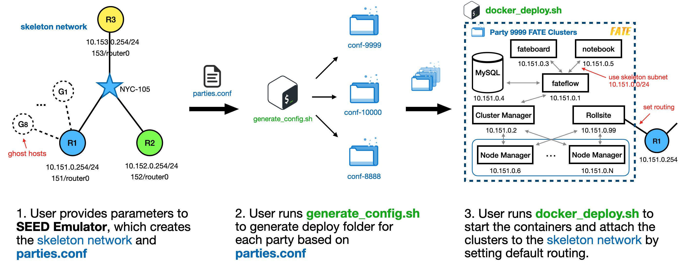
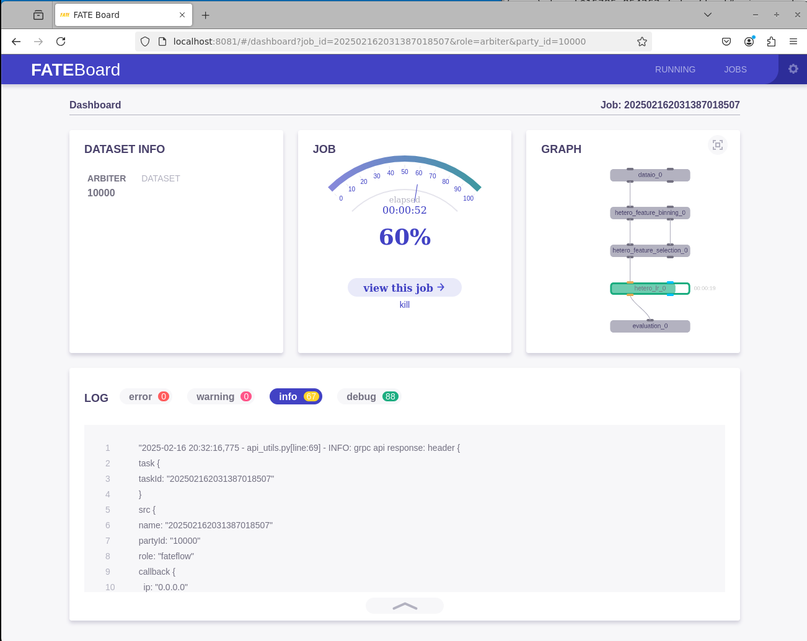
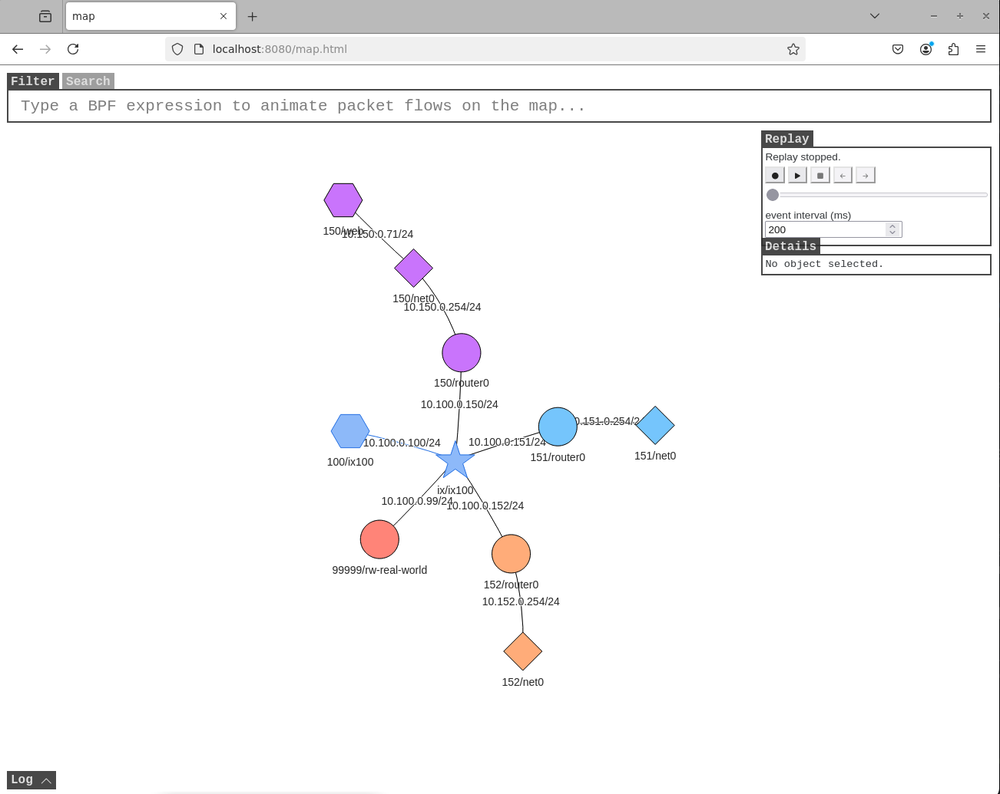

# SeedFATE: build FATE clusters on Seed Emulator

This is a most basic example. In this example, we create three stub autonomous systems, and then create peering among themselves. We deploy three [FATE](https://github.com/FederatedAI/FATE) (Federated AI Technology Enabler) clusters `10000`, `9999` and `8888` within three autonomous systems respectively.

<div align="center">
  
</div>

## Step 1: Create a skeleton network
In the first step, we will use Seed Emulator to generate a skeleton network responsible for the network architecture and underlying environment. Later, the Fate components will be attached into this skeleton network. More details can be found in [Construct A Simple Autonomous Systems Example](https://github.com/seed-labs/seed-emulator/tree/master/examples/basic/A00_simple_as)
### Step 1.1: Import and create required components

```python
from seedemu.layers import Base, Routing, Ebgp
from seedemu.services import WebService
from seedemu.compiler import Docker
from seedemu.core import Emulator, Binding, Filter
```

We will compile the emulation to docker containers.
Once the classes are imported, initialize them:
```python
emu     = Emulator()
base    = Base()
routing = Routing()
ebgp    = Ebgp()
web     = WebService()
```

### Step 1.2: Create Network Components
#### Create an internet exchange

The `Base::createInternetExchange` function call creates a new internet exchange. By default, it creates a new global network name `ix{id}` with network prefix of `10.{id}.0.0/24`, where `{id}` is the ID of the internet exchange. The exchange network can later be joined by router nodes using the `Node::joinNetwork` function call.

```python
base.createInternetExchange(100)
```

Here, the internet exchange `100` is created. It creates the network `ix100` with network prefix of `10.100.0.0/24`
#### Create the autonomous system instance

```python
as150 = base.createAutonomousSystem(150)
```

The call returns an `AutonomousSystem` class instance `as150`, and it can be used to further create hosts and networks in this autonomous system.


#### Create an internal network


The `AutonomousSystem::createNetwork` calls create a new local network (as opposed to the networks created by `Base::createInternetExchange`), which can only be joined by nodes from within the autonomous system. Similar to the `createInternetExchange` call, the `createNetwork` call also automatically assigns network prefixes; it uses `10.{asn}.{id}.0/24` by default.

```python
as150.createNetwork('net0')
```

Here, AutonomousSystem `as150` creates the local network `net0` with network prefix of `10.150.0.0/24`.


#### Create a router and connect it to two networks

```python
as150.createRouter('router0').joinNetwork('net0').joinNetwork('ix100')
```

We will create a router `router0` and connect it to both the internal network `net0` and the network in the internet exchange `ix100`. Basically, we are making this router a BGP router.

### Step 1.3: Create Ghost Hosts for FATE Components

We will create a series of `ghost hosts`, which serve as placeholders within Seed emulator rather than actual nodes. These ghost hosts request necessary network resources from the emulator, such as IP addresses, but do not carry any containers or application loads at this phase. Through the ghost hosts, the emulator clarifies the network topology, ensuring that future containers can connect, route, and communicate as expected.

The reserved ghost hosts information will be restored in `GhostNodes.json`.
Later, the `KubeFATE` will use the previously reserved network resources to create the FATE cluster components and connect them to the already configured skeleton network.


```python
components=["federation","proxy", "fateboard", "roll", "egg", "python", "meta-service", "mysql", "redis"]
for component in components:
    as150.createGhostHost(component).setGPUAccess(True).joinNetwork('net0')
```

The `AutonomousSystem::createGhostHost` API takes one parameter, `name`,
which is the name of the ghost host, and it will return an `Node` instance on success. In this case, we create 9 ghost hosts in `as150` with each host named according to its corresponding FATE component. All ghost hosts are enabled to access the GPU on the host machine and will join `as150`'s internal network `net0`.

### Step 1.4: Set up BGP peering

Once the autonomous systems have been created and interconnected through routers in [step 1.2](#Step-1.2:-Create-Network-Components), the physical connectivity between the two autonomous systems is established. To enable communication between hosts across these autonomous systems, we need to set up the peering among them. Setting up BGP peering is done at the eBGP layer. The following peers the `AS-150`, `AS-151` at the Internet Exchange `IX-100`.

```python
ebgp.addRsPeer(100, 150)
ebgp.addRsPeer(100, 151)
```
In this case, hosts in `as150` are connected to hosts in `as151`.


### Step 1.5: Render and compile the emulation

```python
emu.render()
emu.compile(Docker(), './output', override=True)
emu.compile(GhostPrinter(), './ghost', override=True)
```

After rendering and compiling the emulation, two directories `./output` and `./ghost` are generated.
Inside the `./output` folder, the emulator has generated the `docker-compose.yml` file along with the necessary Docker build materials for each of the network components that were created. Later on, `docker-compose.yml` will create Docker image based on these materials.
The file structure shows like following:

```
./output
├── docker-compose.yml
├── rnode_150_router0
│   ├── Dockerfile
│   └── ...
└── ...

```
The only difference in the `./ghost` folder is that the `docker-compose.yml` file will be generated by `KubeFATE`. Thus, the emulator provides the reserved network information of the FATE components  in `GhostNodes.json` and `AutonomousSystems.json`. The file structure shows like following:
```
./ghost
├── GhostNodes.json
├── AutonomousSystems.json
├── hnode_150_federation
│   ├── Dockerfile
│   └── ...
└── ...

```

### Step 1.6: start network environment emulation
After writing the program, we can directly run it to generate the Docker files. Then, we enter the `./output` folder, run following commands to start the network emulation.
```shell
$ python simple_SeedFATE.py
...
== GhostPrinterCompiler: compiling ghost node 150 for asmysql...
== GhostPrinterCompiler: compiling ghost node 150 for asredis...
== GhostPrinterCompiler: creating ghost_nodes.json...
== GhostPrinterCompiler: creating Autonomous_Systems.json...
$ cd ./output
$ docker compose build --no-cache
...
=> [rnode_150_router0 13/13] COPY 6a1e5579ad5a86c362c6aae90c32215e /tmp/  0.1s
=> [rnode_150_router0] exporting to image                                 0.5s
=> => exporting layers                                                    0.5s
=> => writing image sha256:b636fe32ca96b34cd72cfe63fb350840e6ff5a26d292e  0.0s
=> => naming to docker.io/library/output-rnode_150_router0  
$ docker compose up
...
as100rs-ix100-10.100.0.100          | ready! run 'docker exec -it 6e0077595039 /bin/zsh' to attach to this node
as100rs-ix100-10.100.0.100          | bird: Started
as152r-router0-10.150.0.254         | ready! run 'docker exec -it 6531cb00595f /bin/zsh' to attach to this node
as152r-router0-10.150.0.254         | bird: Started
as151r-router0-10.151.0.254         | ready! run 'docker exec -it 669c9bcd9f83 /bin/zsh' to attach to this node
as151r-router0-10.151.0.254         | bird: Started
...
```
If network emulation starts successfully, the output may look like the above and will continuously display network information. Let it run in the background while we open a new terminal to proceed with the remaining steps.


## Step 2: Generate configuration files
Once we complete the network setup, the remaining steps are very similar to the KubeFATE process. The only difference is that instead of manually editing the `parties.conf`, we will automatically generate it.

To make the ghost node mechanism generalizable for reuse by other frameworks, the seed emulator is not designed to directly output the `parties.conf` configuration file for `KubeFATE`. Instead, we run the `generate_parties_conf.py` script to generate the `parties.conf`. In the future, we may implement `FATE` as an embedded service layer to simplify this process.

### Step 2.1: define FATE architecture tree
To generate the `parties.conf`, we first need to define the FATE cluster architecture using a dictionary variable in the `pre_party_list.json` file. In this dictionary variable, each FATE party ID corresponds to the information of the FATE cluster, where the FATE role mapped to a list of ghost host names created in Step 1.

```json title="pre_party_list.json"
{
    "8888": {                                 // FATE party ID
        "federation": [                        // FATE role
            "hnode_150_federation"             // ghost host name
        ],
        "proxy": [
            "hnode_150_proxy"
        ],
        ...
      }
   ...
}
```
we also provide `pre_party_list.py` to quickly set `pre_party_list.json`

### Step 2.2: generate `parties.conf`

```shell
$ python generate_parties_conf.py
...
Generating start.sh for hnode_150_redis
Generating /etc/hosts for hnode_150_redis
Generating /interface_setup for hnode_150_redis
Generating parties.conf...
```

Based on the FATE architecture tree, the `generate_parties_conf.py` updates the Dockerfile and start commands according to the FATE roles in `./ghost` and generates the `parties.conf`.
### Step 2.3: generate FATE configuration files

```shell
$ cd SEEDFate-v1.3.0
$ bash generate_config.sh
...
federation module of 8888 done!
proxy module of 8888 done!
handle serving
serving of 10000 done!
serving of 9999 done!
serving of 8888 done!
```
Now, same as the KubeFATE, tar files have been generated for each party including the exchange node (party). They are named as `confs-<party-id>.tar` and `serving-<party-id>.tar`.

## Step 3: Deploying FATE to skeleton network
To deploy FATE to all configured target hosts in skeleton network, use the below command:
```shell
$ bash docker_deploy.sh all
...
Creating confs-8888_meta-service_1 ... done
Creating confs-8888_roll_1         ... done
Creating confs-8888_python_1       ... done
Creating confs-8888_fateboard_1    ... done
party 8888 deploy is ok!
```
The `docker_deploy.sh` script will copy the deployment tar files (e.g. `confs-<party-id>.tar` or `serving-<party-id>.tar`)  to the target location specified in the `parties.conf`. By default, this target location is `/data/projects/fate`. Afterward, it launches FATE clusters using `docker-compose` commands to join the skeleton network.

By Default, the script will start the training and serving cluster simultaneously. If you need to start them separately, add the `--training` or `--serving` to the `docker_deploy.sh` as follows.

(Optional) To deploy all parties training cluster, use the below command:
```bash
$ bash docker_deploy.sh all --training
```

(Optional) To deploy all parties serving cluster, use the below command:
```bash
$ bash docker_deploy.sh all --serving
```

Once the commands finish, use `docker ps` to verify the status of the clusters. A sample output is as follows:
```shell
$ docker ps
CONTAINER ID   IMAGE                                                 COMMAND                  CREATED              STATUS              PORTS                                       NAMES
0f75c04c4ec4   federatedai/fateboard:1.3.0-release-8888              "sh /start.sh"           About a minute ago   Up About a minute   0.0.0.0:8083->8080/tcp, :::8083->8080/tcp   confs-8888_fateboard_1
a4e209943a04   federatedai/python:1.3.0-release-8888                 "sh /start.sh"           About a minute ago   Up About a minute   9360/tcp, 9380/tcp                          confs-8888_python_1
8baee985a037   federatedai/roll:1.3.0-release-8888                   "sh /start.sh"           About a minute ago   Up About a minute   8011/tcp                                    confs-8888_roll_1
b240cc15e228   federatedai/meta-service:1.3.0-release-8888           "sh /start.sh"           About a minute ago   Up About a minute   8590/tcp                                    confs-8888_meta-service_1
ff4870ae044a   redis:5-8888                                          "sh /start.sh redis-."   About a minute ago   Up About a minute   6379/tcp                                    confs-8888_redis_1
94546f2833ec   mysql:8-8888                                          "sh /start.sh"           About a minute ago   Up About a minute   3306/tcp, 33060/tcp                         confs-8888_mysql_1
2de1bf392ed4   federatedai/egg:1.3.0-release-8888                    "sh /start.sh"           About a minute ago   Up About a minute   7778/tcp, 7888/tcp, 50000-60000/tcp         confs-8888_egg_1
...

```

### Verify the deployment success
On the host machine, each party has a container named `confs-<party_id>_python_1` should have been created and running the `fate-flow` service. For example, we login to party 10000's python container, run the following commands to verify the deployment:
```shell
$ docker exec -it confs-10000_python_1 bash     # log in the python container
(venv) [root@ac78063a7964 python]$ cd /data/projects/fate/python/examples/toy_example
(venv) [root@ac78063a7964 toy_example]$ python run_toy_example.py 10000 9999 1     #run testing script, 1 means multi-clusters
```
If the test passed, the output may look like the following:
```
"2025-02-16 07:12:44,600 - secure_add_guest.py[line:101] - INFO: begin to init parameters of secure add example guest"
"2025-02-16 07:12:44,600 - secure_add_guest.py[line:104] - INFO: begin to make guest data"
"2025-02-16 07:12:46,021 - secure_add_guest.py[line:107] - INFO: split data into two random parts"
"2025-02-16 07:12:52,295 - secure_add_guest.py[line:110] - INFO: share one random part data to host"
"2025-02-16 07:12:52,808 - secure_add_guest.py[line:113] - INFO: get share of one random part data from host"
"2025-02-16 07:12:57,867 - secure_add_guest.py[line:116] - INFO: begin to get sum of guest and host"
"2025-02-16 07:12:58,505 - secure_add_guest.py[line:119] - INFO: receive host sum from guest"
"2025-02-16 07:12:58,582 - secure_add_guest.py[line:126] - INFO: success to calculate secure_sum, it is 2000.0"

```

### Verify the serving service
we use the three deployed FATE clusters to perform a simple training and inference test. The dataset used for training is the simple test dataset `examples/data/breast` provided by FATE, which is split into two parts: `breast_a` and `breast_b`. The host `party 9999` holds `breast_a`, while the guest `party 8888` holds `breast_b`. The `party 10000` acts as arbiter. The guest and host collaborate to perform logistic regression training on the dataset. Once the training is complete, the resulting model is pushed to FATE Serving for online inference.

First we upload data on `party 9999`.

```shell
$ docker exec -it confs-9999_python_1 bash       # log in the python container
(venv) [root@9ed5fbb241b8 python]$ cd fate_flow
(venv) [root@9ed5fbb241b8 fate_flow]$ vi examples/upload_host.json     # modify upload configuration json as following

{
  "file": "examples/data/breast_a.csv",
  "head": 1,
  "partition": 10,
  "work_mode": 1,
  "namespace": "fate_flow_test_breast",
  "table_name": "breast"
}

(venv) [root@9ed5fbb241b8 fate_flow]$ python fate_flow_client.py -f upload -c examples/upload_host.json   # upload “breast_a.csv”
{
    "data": {
        "board_url": "http://fateboard:8080/index.html#/dashboard?job_id=202502162023481110724&role=local&party_id=0",
        "job_dsl_path": "/data/projects/fate/python/jobs/202502162023481110724/job_dsl.json",
        "job_runtime_conf_path": "/data/projects/fate/python/jobs/202502162023481110724/job_runtime_conf.json",
        "logs_directory": "/data/projects/fate/python/logs/202502162023481110724",
        "namespace": "fate_flow_test_breast",
        "table_name": "breast"
    },
    "jobId": "202502162023481110724",
    "retcode": 0,
    "retmsg": "success"
}
```

Then we upload data on `party 8888`.

```shell
$ docker exec -it confs-8888_python_1 bash       # log in the python container
(venv) [root@15785e854262 python]$ cd fate_flow
(venv) [root@15785e854262 fate_flow]$ vi examples/upload_guest.json     # modify upload configuration json as following

{
  "file": "examples/data/breast_b.csv",
  "head": 1,
  "partition": 10,
  "work_mode": 1,
  "namespace": "fate_flow_test_breast",
  "table_name": "breast"
}

(venv) [root@15785e854262 fate_flow]$ python fate_flow_client.py -f upload -c examples/upload_guest.json   # upload “breast_b.csv”
{
    "data": {
        "board_url": "http://fateboard:8080/index.html#/dashboard?job_id=202502162028553859656&role=local&party_id=0",
        "job_dsl_path": "/data/projects/fate/python/jobs/202502162028553859656/job_dsl.json",
        "job_runtime_conf_path": "/data/projects/fate/python/jobs/202502162028553859656/job_runtime_conf.json",
        "logs_directory": "/data/projects/fate/python/logs/202502162028553859656",
        "namespace": "fate_flow_test_breast",
        "table_name": "breast"
    },
    "jobId": "202502162028553859656",
    "retcode": 0,
    "retmsg": "success"
}
```
then we modify training configuration json and submit the job to train the uploaded dataset.
```shell
(venv) [root@15785e854262 fate_flow]$ vi examples/test_hetero_lr_job_conf.json     # modify training configuration json as following

{
    "initiator": {
        "role": "guest",
        "party_id": 8888
    },
    "job_parameters": {
        "work_mode": 1
    },
    "role": {
        "guest": [8888],
        "host": [9999],
        "arbiter": [10000]
    },
    "role_parameters": {
        "guest": {
            "args": {
                "data": {
                    "train_data": [{"name": "breast", "namespace": "fate_flow_test_breast"}]
                }
            },
            "dataio_0":{
                "with_label": [true],
                "label_name": ["y"],
                "label_type": ["int"],
                "output_format": ["dense"]
            }
        },
        "host": {
            "args": {
                "data": {
                    "train_data": [{"name": "breast", "namespace": "fate_flow_test_breast"}]
                }
            },
             "dataio_0":{
                "with_label": [false],
                "output_format": ["dense"]
            }
        }
    },
    ...
}
(venv) [root@15785e854262 fate_flow]$ python fate_flow_client.py -f submit_job -d examples/test_hetero_lr_job_dsl.json -c examples/test_hetero_lr_job_conf.json   # Submit job
{
    "data": {
        "board_url": "http://fateboard:8080/index.html#/dashboard?job_id=202502162031387018507&role=guest&party_id=8888",
        "job_dsl_path": "/data/projects/fate/python/jobs/202502162031387018507/job_dsl.json",
        "job_runtime_conf_path": "/data/projects/fate/python/jobs/202502162031387018507/job_runtime_conf.json",
        "logs_directory": "/data/projects/fate/python/logs/202502162031387018507",
        "model_info": {
            "model_id": "arbiter-10000#guest-8888#host-9999#model",
            "model_version": "202502162031387018507"
        }
    },
    "jobId": "202502162031387018507",
    "retcode": 0,
    "retmsg": "success"
}

```
We open browser and navigate to [`localhost:8081`](localhost:8081) to access `Fateboard`, where we can view the visualized task training results.

<div align="center">
  
</div>

### Deployment Successful!
So far, SeedFATE has been successfully launched. Users can now use FATE as they would in a real-world scenario with multiple hosts.

If you go to [Seed Emulator GUI console](http://localhost:8080/map.html), you may see the network topology look like the following

<div align="center">
  
</div>

## Terminate Emulation
Use this command to stop all cluster:
```shell
$ bash docker_deploy.sh --del all
```
Use this command to stop network environment:
```shell
$ ../output
$ docker compose down
```
